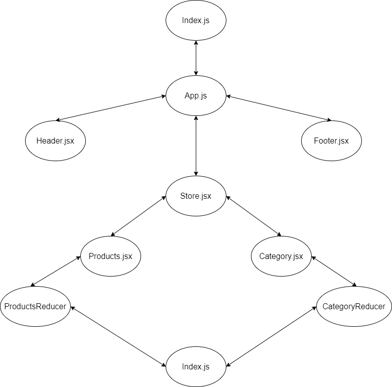
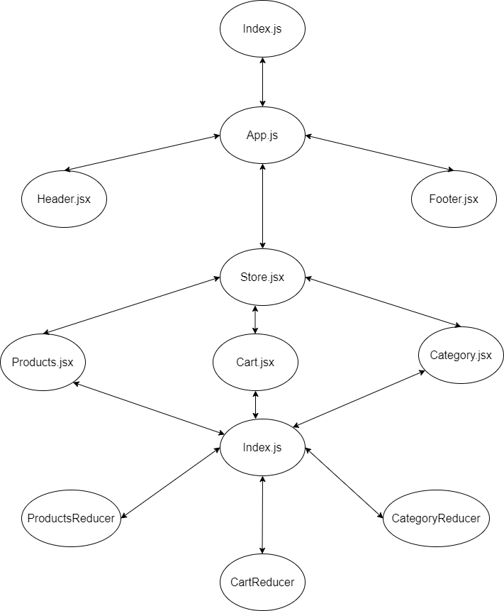

# Storefront

### Description 

we will be starting the process of creating an e-Commerce storefront using React with Redux, coupled with your live API server. 

## Links

[Repo Link](https://github.com/yasmeenokh/storefront)

[Pull Requests](https://github.com/yasmeenokh/storefront/pulls)

[Deployed Link](https://admiring-lumiere-e7e00c.netlify.app/)

## First Phase :

### White Board:

## Second Phase : 

### Description:
Phase 2: Continue work on the e-Commerce storefront, breaking up the store into multiple reducers and sharing functionality/data between components.

### White Board:

